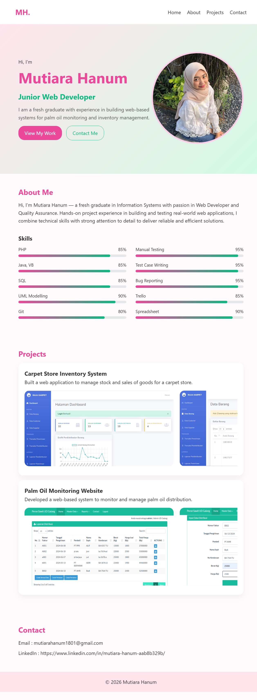
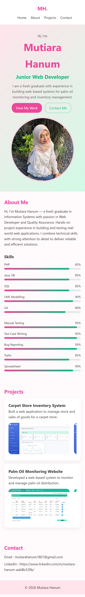

# Results

## GitHub Repository
https://github.com/mutiarahanum/mutiara-portfolio

## Live Website
https://mutiarahanum.github.io/mutiara-portfolio/

## Screenshots

### Desktop View

### Mobile View

## Reflection

In this project, I learned how to build a modern and responsive portfolio website using HTML and CSS.

I also learned how to use AI effectively to assist development, while still understanding the code and structure.

Additionally, I learned how to deploy a website using GitHub Pages and organize project documentation properly.